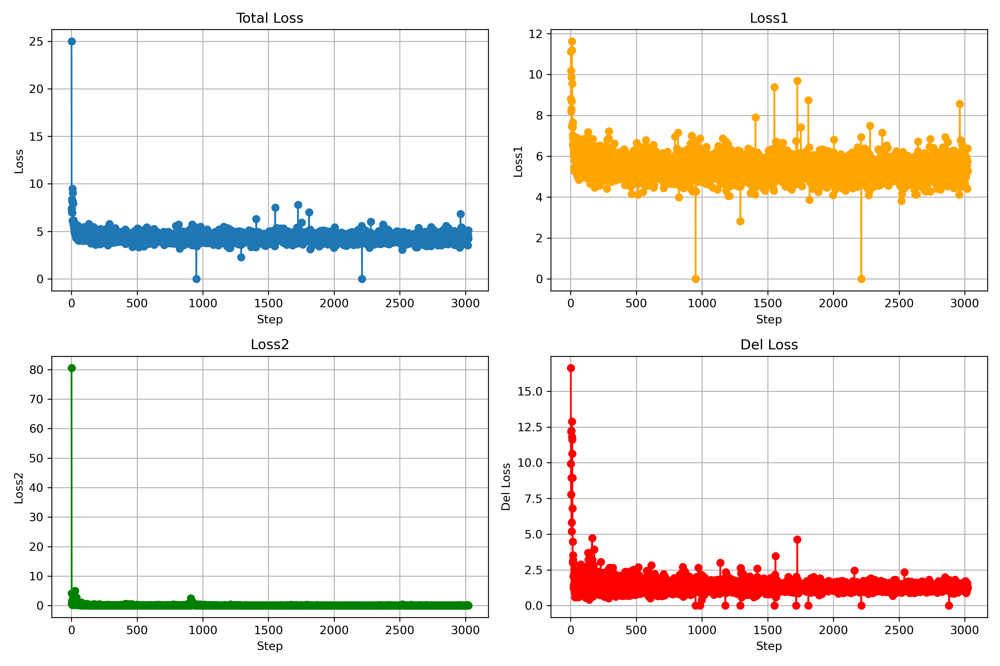
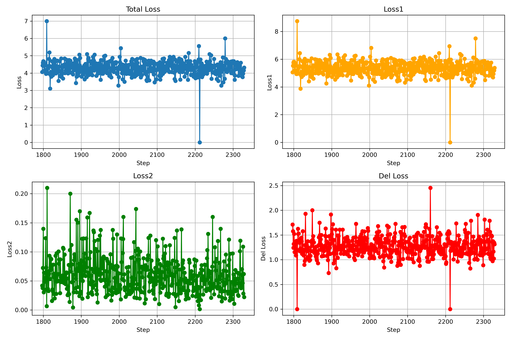

# GroupB
This is a cooperation project of training FlexMDM based on LLaDA-8B-base  


---
### Download our works
run following to git clone
```bash
git clone https://github.com/canxu-star/GroupB.git
```
---
## data_process
Data processing is required before training
```bash
python run_processing.py --split train --num_proc 8
python run_processing.py --split validation --num_proc 4
python run_processing.py --split test --output_dir ./custom_output
```

---
### Download requirements and models
run following to download requirements and model ,the scrupt will automatically replace the config of model:
```bash
bash pip_pods.sh
```

if you just want to download python requirement,run this:
```bash
bash pip.sh
```

---
### Run the train script
run following to train SFT model
```bash
bash train_SFT.sh
```

now the work hasn`t done,you need to use this command
```python
python src/trainer.py
```

run following to train RL model
```bash
bash train_RL.sh
```

---
### Our losses are incredible
<table>
<tr>
<td></td><td></td>
</tr>
<tr>
<td></td><td></td>
</tr>
<tr>
<td></td><td></td>
</tr>

</table>

